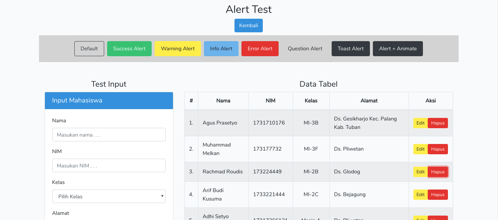
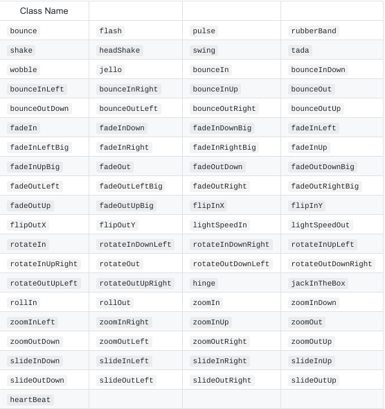

# Laravel Test

## Test List
1. SweetAlert2 + Animate CSS



<br>

- Tabel Animate CSS


----------
- Penempatan file JS Sweetalert

Untuk sweetalert yang digunakan adalah yang `sweetalert.all.js` yang mana itu adalah hasil dari package **SweetAlert For Laravel** dari *realrashid*

```javascript
<script src="{{ asset('vendor/sweetalert/js/sweetalert.all.js')  }}"></script>
```
> Jadi untuk script nya di import ke main layout agar dapat di akses sweetalert yang di package dan sweetalert yang custom dibuat sendiri